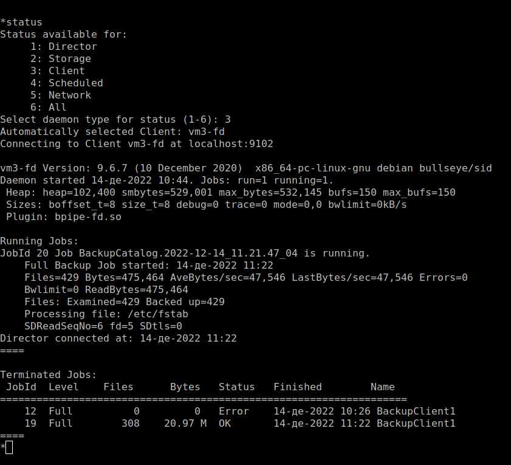
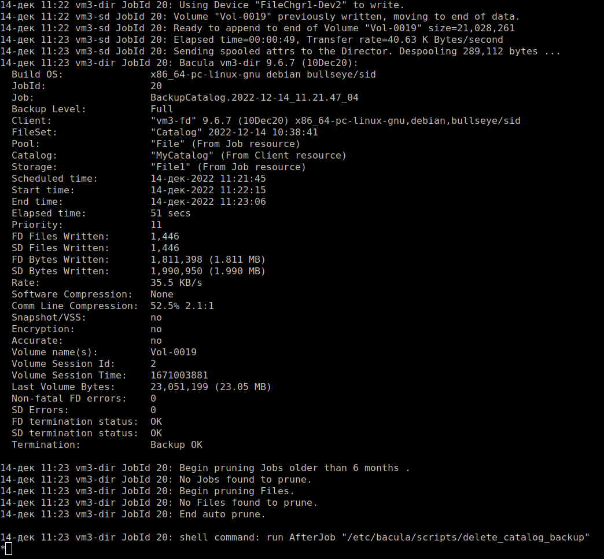
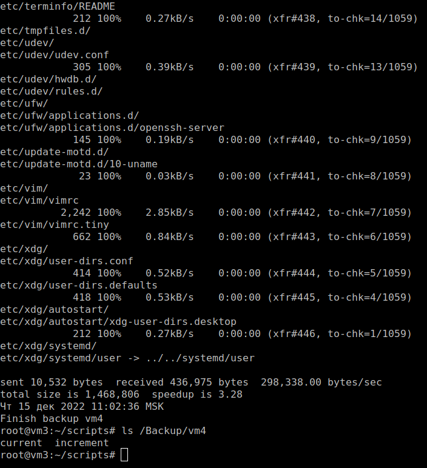

# Домашнее задание к занятию "`10.4 Резервное копирование`" - `Живарев Игорь`


### Задание 1

`Приведите ответ в свободной форме........`

1. `Полный бэкап - этот тип резервного копирования ведет к созданию полной копии исходного набора данных. Он считается лучшим вариантом защиты в плане простоты и скорости восстановления. Тем не менее ввиду больших объемов копируемых данных в данном случае процесс оказывается ощутимо более времязатратным в сравнении с другими типами бэкапа. Помимо этого, полный бэкап при каждом выполнении оказывает существенную нагрузку на сеть, тем самым препятствуя выполнению рабочих операций инфраструктуры. К тому же регулярное выполнение полного копирования требует огромных запасов хранилища в резервном репозитории.`

2. `Инкрементальные бэкапы (англ.) позволяют сократить количество времени и сетевую нагрузку, необходимые для выполнения последовательного полного копирования данных. Стартовой точкой в таком случае выступает один полный бэкап, после чего с каждым последующим инкрементом копируются только те блоки данных, которые изменились с момента последнего бэкапа. Затем, спустя некоторый промежуток времени, определяемый политикой хранения резервных копий, создается очередной полный бэкап, также сопровождаемый инкрементами.`

3. `Дифференциальный бэкап (англ.) – это промежуточное решение между полным бэкапом и инкрементальным. По аналогии с инкрементальным, здесь также стартовой точкой выступает полное резервное копирование, за которым следует внесение в бэкап только изменений.`

`Отличие же в том, что изменения вносятся не с момента последнего копирования, а с момента первичного полного бэкапа. То есть начальный бэкап в этом случае оказывается постоянной точкой обращения для всех следующих за ним этапов резервного копирования. Такой подход позволяет быстрее восстанавливать данные в сравнении с инкрементальным, поскольку требует в этом процессе только двух компонентов – начального полного бэкапа и последнего дифференциального.`

---
### Задание 2

``


```
/etc/bacula/bacula-dir.conf

Director {                            # define myself
  Name = vm3-dir
  DIRport = 9101                # where we listen for UA connections
  QueryFile = "/etc/bacula/scripts/query.sql"
  WorkingDirectory = "/var/lib/bacula"
  PidDirectory = "/run/bacula"
  Maximum Concurrent Jobs = 20
  Password = "WfIfGefYn-u1Gcf0NobMM9edrDRy9e0Zj"         # Console password
  Messages = Daemon
  DirAddress = 127.0.0.1
}

JobDefs {
  Name = "DefaultJob"
  Type = Backup
  Level = Incremental
  Client = vm3-fd
  FileSet = "Full Set"
  Schedule = "WeeklyCycle"
  Storage = File1
  Messages = Standard
  Pool = File
  SpoolAttributes = yes
  Priority = 10
  Write Bootstrap = "/var/lib/bacula/%c.bsr"
}

Job {
  Name = "BackupClient1"
  JobDefs = "DefaultJob"
}
Job {
  Name = "BackupCatalog"
  JobDefs = "DefaultJob"
  Level = Full
  FileSet="Catalog"
  Schedule = "WeeklyCycleAfterBackup"
  # This creates an ASCII copy of the catalog
  # Arguments to make_catalog_backup.pl are:
  #  make_catalog_backup.pl <catalog-name>
  RunBeforeJob = "/etc/bacula/scripts/make_catalog_backup.pl MyCatalog"
  # This deletes the copy of the catalog
  RunAfterJob  = "/etc/bacula/scripts/delete_catalog_backup"
  Write Bootstrap = "/var/lib/bacula/%n.bsr"
  Priority = 11                   # run after main backup
}

Job {
  Name = "RestoreFiles"
  Type = Restore
  Client=vm3-fd
  Storage = File1
# The FileSet and Pool directives are not used by Restore Jobs
# but must not be removed
  FileSet="Full Set"
  Pool = File
  Messages = Standard
#  Where = /nonexistant/path/to/file/archive/dir/bacula-restores
  Where = /Backup
}

FileSet {
  Name = "Full Set"
  Include {
    Options {
      signature = MD5
    }

    File = /usr/sbin
  }
  Exclude {
    File = /var/lib/bacula
#    File = /nonexistant/path/to/file/archive/dir
    File = /Backup
    File = /proc
    File = /tmp
    File = /sys
    File = /.journal
    File = /.fsck
  }
}

Schedule {
  Name = "WeeklyCycle"
  Run = Full 1st sun at 23:05
  Run = Differential 2nd-5th sun at 23:05
  Run = Incremental mon-sat at 23:05
}

# This schedule does the catalog. It starts after the WeeklyCycle
Schedule {
  Name = "WeeklyCycleAfterBackup"
  Run = Full sun-sat at 23:10
}

# This is the backup of the catalog
FileSet {
  Name = "Catalog"
  Include {
    Options {
      signature = MD5
    }
#    File = "/var/lib/bacula/bacula.sql"
    File = "/etc"
  }
}

 Client (File Services) to backup
Client {
  Name = vm3-fd
  Address = localhost
  FDPort = 9102
  Catalog = MyCatalog
  Password = "Xm0PdsdawCfdRVUON4FjFKL7z5CHRImMv"          # password for FileDaemon
  File Retention = 60 days            # 60 days
  Job Retention = 6 months            # six months
  AutoPrune = yes                     # Prune expired Jobs/Files
}

Autochanger {
  Name = File1
# Do not use "localhost" here
  Address = localhost                # N.B. Use a fully qualified name here
  SDPort = 9103
  Password = "_6G0xJmSljJ2Kokl0lK7fO8cQETvUwkyd"
  Device = FileChgr1
  Media Type = File1
  Maximum Concurrent Jobs = 10        # run up to 10 jobs a the same time
  Autochanger = File1                 # point to ourself
}

# Definition of a second file Virtual Autochanger device
#   Possibly pointing to a different disk drive
Autochanger {
  Name = File2
# Do not use "localhost" here
  Address = localhost                # N.B. Use a fully qualified name here
  SDPort = 9103
  Password = "_6G0xJmSljJ2Kokl0lK7fO8cQETvUwkyd"
  Device = FileChgr2
  Media Type = File2
  Autochanger = File2                 # point to ourself
  Maximum Concurrent Jobs = 10        # run up to 10 jobs a the same time
}

Catalog {
  Name = MyCatalog
  dbname = "bacula"; DB Address = "localhost"; dbuser = "bacula"; dbpassword = "123"
}

# Reasonable message delivery -- send most everything to email address
#  and to the console
Messages {
  Name = Standard
  mailcommand = "/usr/sbin/bsmtp -h localhost -f \"\(Bacula\) \<%r\>\" -s \"Bacula: %t %e of %c %l\" %r"
  operatorcommand = "/usr/sbin/bsmtp -h localhost -f \"\(Bacula\) \<%r\>\" -s \"Bacula: Intervention needed for %j\" %r"
  mail = root = all, !skipped
  operator = root = mount
  console = all, !skipped, !saved
#
# WARNING! the following will create a file that you must cycle from
#          time to time as it will grow indefinitely. However, it will
#          also keep all your messages if they scroll off the console.
#
  append = "/var/log/bacula/bacula.log" = all, !skipped
  catalog = all
}


Messages {
  Name = Daemon
  mailcommand = "/usr/sbin/bsmtp -h localhost -f \"\(Bacula\) \<%r\>\" -s \"Bacula daemon message\" %r"
  mail = root = all, !skipped
  console = all, !skipped, !saved
  append = "/var/log/bacula/bacula.log" = all, !skipped
}

# Default pool definition
Pool {
  Name = Default
  Pool Type = Backup
  Recycle = yes                       # Bacula can automatically recycle Volumes
  AutoPrune = yes                     # Prune expired volumes
  Volume Retention = 365 days         # one year
  Maximum Volume Bytes = 50G          # Limit Volume size to something reasonable
  Maximum Volumes = 100               # Limit number of Volumes in Pool
}


# File Pool definition
Pool {
  Name = File
  Pool Type = Backup
  Recycle = yes                       # Bacula can automatically recycle Volumes
  AutoPrune = yes                     # Prune expired volumes
  Volume Retention = 365 days         # one year
  Maximum Volume Bytes = 50G          # Limit Volume size to something reasonable
  Maximum Volumes = 100               # Limit number of Volumes in Pool
  Label Format = "Vol-"               # Auto label
}


# Scratch pool definition
Pool {
  Name = Scratch
  Pool Type = Backup
}

#
# Restricted console used by tray-monitor to get the status of the director
#
Console {
  Name = vm3-mon
  Password = "vhmM2NdtGMa0Br5IPGtOITNVnGnStNS6Q"
  CommandACL = status, .status
}


`/etc/bacula/bacula-sd.conf`

Storage {                             # definition of myself
  Name = vm3-sd
  SDPort = 9103                  # Director's port
  WorkingDirectory = "/var/lib/bacula"
  Pid Directory = "/run/bacula"
  Plugin Directory = "/usr/lib/bacula"
  Maximum Concurrent Jobs = 20
  SDAddress = 127.0.0.1
}

#
# List Directors who are permitted to contact Storage daemon
#
Director {
  Name = vm3-dir
  Password = "_6G0xJmSljJ2Kokl0lK7fO8cQETvUwkyd"
}

#
# Restricted Director, used by tray-monitor to get the
#   status of the storage daemon
#
Director {
  Name = vm3-mon
  Password = "grMhoCcsUQh8r-icOv4P1WCLuyAjo6LR8"
  Monitor = yes
}

Autochanger {
  Name = FileChgr1
  Device = FileChgr1-Dev1, FileChgr1-Dev2
  Changer Command = ""
  Changer Device = /dev/null
}

Device {
  Name = FileChgr1-Dev1
  Media Type = File1
#  Archive Device = /nonexistant/path/to/file/archive/dir
  Archive Device = /Backup
  LabelMedia = yes;                   # lets Bacula label unlabeled media
  Random Access = Yes;
  AutomaticMount = yes;               # when device opened, read it
  RemovableMedia = no;
  AlwaysOpen = no;
  Maximum Concurrent Jobs = 5
}

Device {
  Name = FileChgr1-Dev2
  Media Type = File1
#  Archive Device = /nonexistant/path/to/file/archive/dir
Archive Device = /Backup
  LabelMedia = yes;                   # lets Bacula label unlabeled media
  Random Access = Yes;
  AutomaticMount = yes;               # when device opened, read it
  RemovableMedia = no;
  AlwaysOpen = no;
  Maximum Concurrent Jobs = 5
}

#
# Define a second Virtual autochanger
#
Autochanger {
  Name = FileChgr2
  Device = FileChgr2-Dev1, FileChgr2-Dev2
  Changer Command = ""
  Changer Device = /dev/null
}

Device {
  Name = FileChgr2-Dev1
  Media Type = File2
#  Archive Device = /nonexistant/path/to/file/archive/dir
  Archive Device = /Backup
  LabelMedia = yes;                   # lets Bacula label unlabeled media
  Random Access = Yes;
  AutomaticMount = yes;               # when device opened, read it
  RemovableMedia = no;
  AlwaysOpen = no;
  Maximum Concurrent Jobs = 5
}

Device {
  Name = FileChgr2-Dev2
  Media Type = File2
#  Archive Device = /nonexistant/path/to/file/archive/dir
  Archive Device = /Backup
  LabelMedia = yes;                   # lets Bacula label unlabeled media
  Random Access = Yes;
  AutomaticMount = yes;               # when device opened, read it
  RemovableMedia = no;
  AlwaysOpen = no;
  Maximum Concurrent Jobs = 5
}

Device {
  Name = FileChgr2-Dev2
  Media Type = File2
#  Archive Device = /nonexistant/path/to/file/archive/dir
  Archive Device = /Backup
  LabelMedia = yes;                   # lets Bacula label unlabeled media
  Random Access = Yes;
  AutomaticMount = yes;               # when device opened, read it
  RemovableMedia = no;
  AlwaysOpen = no;
  Maximum Concurrent Jobs = 5
}

Messages {
  Name = Standard
  director = vm3-dir = all
}


`/etc/bacula/bacula-fd.conf`


Director {
  Name = vm3-dir
  Password = "Xm0PdsdawCfdRVUON4FjFKL7z5CHRImMv"
}

#
# Restricted Director, used by tray-monitor to get the
#   status of the file daemon
#
Director {
  Name = vm3-mon
  Password = "_L7Eb_rjGY6NnTXdAlJpT1dE4t3FX_sIz"
  Monitor = yes
}

#
# "Global" File daemon configuration specifications
#
FileDaemon {                          # this is me
  Name = vm3-fd
  FDport = 9102                  # where we listen for the director
  WorkingDirectory = /var/lib/bacula
  Pid Directory = /run/bacula
  Maximum Concurrent Jobs = 20
  Plugin Directory = /usr/lib/bacula
  FDAddress = 127.0.0.1
}

Messages {
  Name = Standard
  director = vm3-dir = all, !skipped, !restored
}

....


```






---

### Задание 2

``


```
/etc/rsyncd.conf


pid file = /var/run/rsyncd.pid
log file = /var/log/rsyncd.log
transfer logging = true
munge symlinks = yes
[data]
path = /Backup/
uid = root
read only = yes
list = yes
comment = Data backup Dir
auth users = root
secrets file = /etc/rsyncd.scrt


/root/scripts/backup-node1.sh


#!/bin/bash
# data
# Папка, куда будем складывать архивы — ее либо сразу создать либо не создавать а положить в уже существующие
syst_dir=/Backup/
# Имя сервера, который архивируем
srv_name=vm4 #из тестовой конфигурации
# Адрес сервера, который архивируем
srv_ip=192.168.20.114
# Пользователь rsync на сервере, который архивируем
srv_user=root
# Ресурс на сервере для бэкапа
srv_dir=data
echo "Start backup ${srv_name}"
# Создаем папку для инкрементных бэкапов
mkdir -p ${syst_dir}${srv_name}/increment/
/usr/bin/rsync -avz --progress --delete --password-file=/etc/rsyncd.scrt ${srv_user}@${srv_ip}::${srv_dir} ${syst_dir}${srv_name}/current/ --backup --backup-dir=${syst_dir}${srv_name}/increm>
/usr/bin/find ${syst_dir}${srv_name}/increment/ -maxdepth 1 -type d -mtime +30 -exec rm -rf {} \;
data
echo "Finish backup ${srv_name}"

```




---
